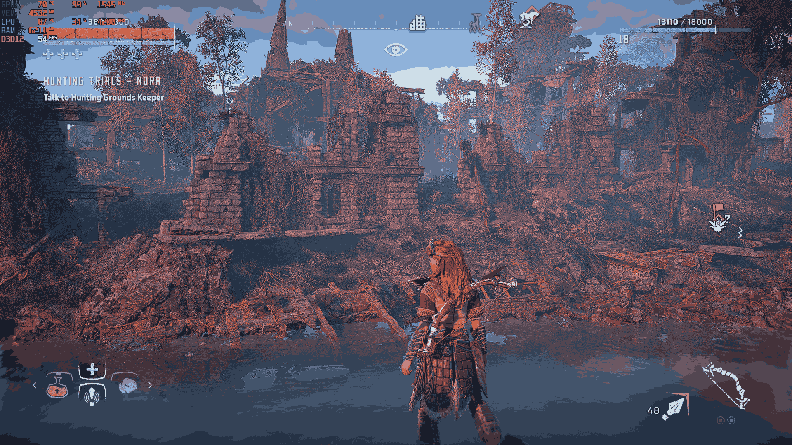

# Image Quantizer

**Image Quantizer** is a Python-based tool for applying **K-Means clustering** to images, primarily for reducing image storage size while maintaining visual quality. By quantizing colors, it effectively compresses large images without noticeable loss of detail.

---

## Project Overview

### Motivation
This project demonstrates the power of K-Means clustering for image quantization. A notable use case includes reducing storage space for screenshots, artwork, or photographs while preserving the original aesthetic. For example, a **4.6 MB** image of Horizon Zero Dawn gameplay was reduced to **1.3 MB**, a nearly **4x space savings**, with minimal impact on visible details.

### Features
- Quantizes images using K-Means clustering implemented from scratch.
- Reduces file size without significant loss in quality.
- Outputs both visual and storage-space savings.
- Easily expandable for new functionalities or integrations with other ML methods.

---

## Project Structure

Here is the current structure of the project repository:

```plaintext
image-quantizer/
├── data/               # Folder for input images
├── outputs/            # Folder for quantized images and other artifacts
├── notebooks/          # Jupyter notebooks (or Sublime Text tests) for prototyping
├── src/image_quantizer.py  # Main Python script + to add modular src code
├── requirements.txt    # Project Python dependencies
├── README.md           # Project description and instructions
```


---

## 📝 Get started

### LIBRAIRIES DEPENDENCIES
- Python 3.8 or higher
- Install dependencies:
  ```bash
  pip install -r requirements.txt
  ```

### Usage
  - Add your image(s) to the assets/ directory.
  - Run the script to quantize an image:
  ```bash
  python src/image_quantizer.py
  ```


  The quantized image will be saved in the outputs/ directory.
  
  >> Example
  Quantize a Horizon Zero Dawn screenshot:

  >>> Input: assets/HZD-6.png
  Command:

  ```bash
  python src/image_quantizer.py
  ```
    
  Output:
  
  Quantized image: outputs/quantized_HZD-6.png
  Original size: 4.6 MB
  Quantized size: 1.3 MB


### Visual Comparison

| Original Image                  | Quantized Image (16 Colors)       |
|---------------------------------|-----------------------------------|
|  |  |


### Current Goals

  - Clean and organize the project for future expandability.
  - Explore automated tests and CI/CD integration.
  - Experiment with additional clustering methods in notebooks/.
  
### Expandable Features
  
  - This is just the beginning! Planned extensions include:

  Adding advanced quantization techniques such as:
    - Adaptive K-Means
    - Histogram-based quantization
    - Integrating GUI support for easier interaction.
    - Exploring dynamic clustering for improved results across a variety of images.
    - Supporting multi-threading for processing large datasets of images.

### Contribution Guidelines

  Contributions are welcome! Feel free to:
  
  - Fork the repository.
  - Create feature branches.
  - Submit a pull request with your improvements.


### Acknowledgments

  The beautiful Horizon Zero Dawn screenshot used in this example is for educational and non-commercial purposes.
  Inspired by the power of clustering techniques in machine learning.
    
### License
This project is licensed under the MIT License.

